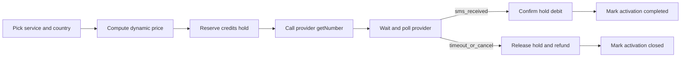

# Economics architecture

This page maps the economics model into concrete backend and frontend responsibilities. It is the source of truth for implementation sequencing and cross-team alignment.

---

## Define domains

- Identity: user, session, account, verification
- Credits: wallet, lots, transactions, holds, purchases, packages
- Catalog: services, country prices, dynamic pricing rules
- Providers: provider config, wholesale cost snapshots, health logs
- Activation: SMS activation lifecycle and state transitions
- Commercial: referral, promo, VIP, agent tiers and assignments
- Risk and controls: fraud rules/events, admin audits, approvals
- Runtime config: key-value economics parameters in `platform_config`

---

## Map lifecycle flows

```mermaid
flowchart LR
  choosePackage[Choose package] --> createPurchase[Create purchase pending]
  createPurchase --> initPayment[Init payment gateway]
  initPayment --> webhook[Receive provider webhook]
  webhook --> confirmPurchase[Confirm purchase]
  confirmPurchase --> createLots[Create base and bonus lots]
  createLots --> updateWallet[Update wallet aggregates]
  updateWallet --> creditTxn[Insert credit transactions]
```

---

## Track state transitions

- Purchase states: `initiated -> payment_pending -> confirmed -> credited` and terminal `failed/refunded`
- Hold states: `held -> debited` or `held -> released/expired`
- Activation states: `requested -> assigned -> waiting -> received -> completed` with terminal `failed/expired/cancelled/refunded`
- Approval states: `pending -> approved/rejected` for manual high-risk credit adjustments

---

## Bind economics rules

| Rule | Config key | Consumed by | Primary API | Primary UI |
| --- | --- | --- | --- | --- |
| Base credit value | `credit_value_xaf` | pricing + margin logic | `GET /api/client/services/prices` | client service explorer |
| Bonus expiration | `bonus_expiry_days` | credit purchase crediting | webhook + purchase processing | wallet/history |
| Promo expiration | `promo_expiry_days` | promo and lot creation | promo apply + purchase | promo input + history |
| Margin floor | `min_margin_multiplier` | pricing engine | service pricing endpoints | admin pricing screen |
| Fraud limits | fraud keys group | fraud evaluator | activation and purchase endpoints | admin fraud monitor |
| 4-eyes threshold | `four_eyes_threshold` | admin adjustment service | admin approvals endpoints | admin adjustments page |

---

## Organize implementation slices

1. Add DB schema and seeds for economics domains
2. Replace hardcoded constants with typed config reader
3. Ship credit ledger + hold engine with transactions
4. Ship purchase and payment webhook orchestration
5. Ship activation orchestration and provider routing
6. Expose client/admin APIs and wire app pages
7. Add jobs, observability, auditability, and tests

---

## Verify readiness

- No runtime hardcoded economics constants in business paths
- Every mutation path writes transaction or audit logs
- Admin can update config and observe effect without redeploy
- Purchase and activation flows are idempotent and replay-safe
