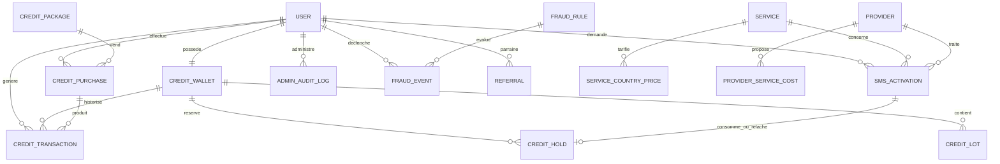
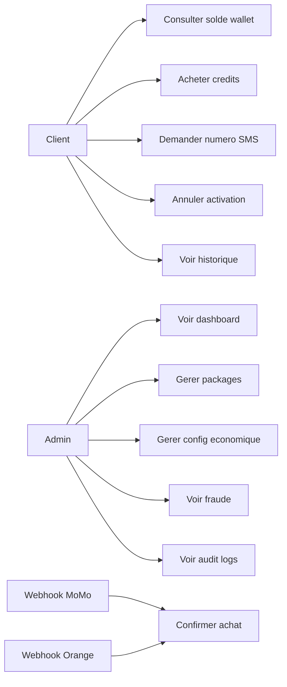
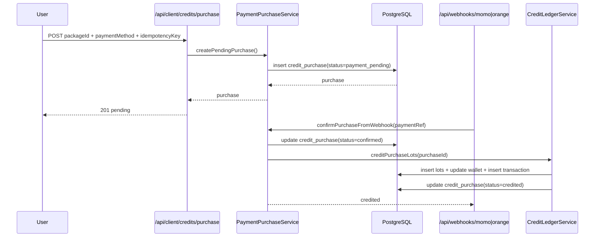
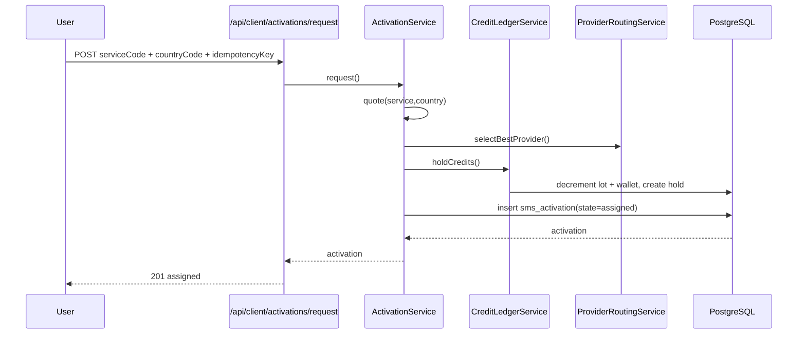
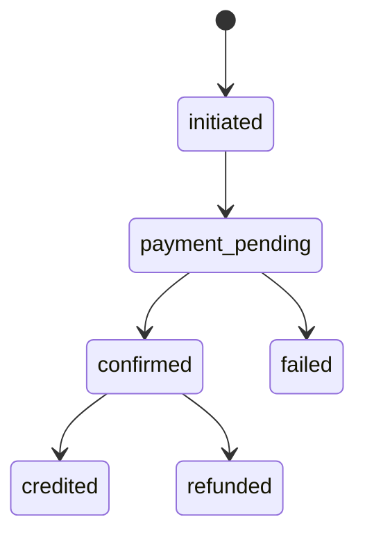
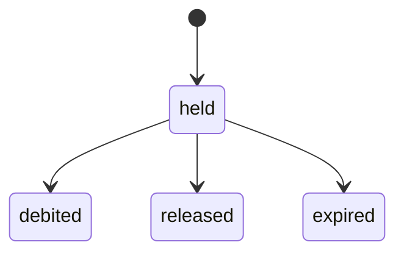
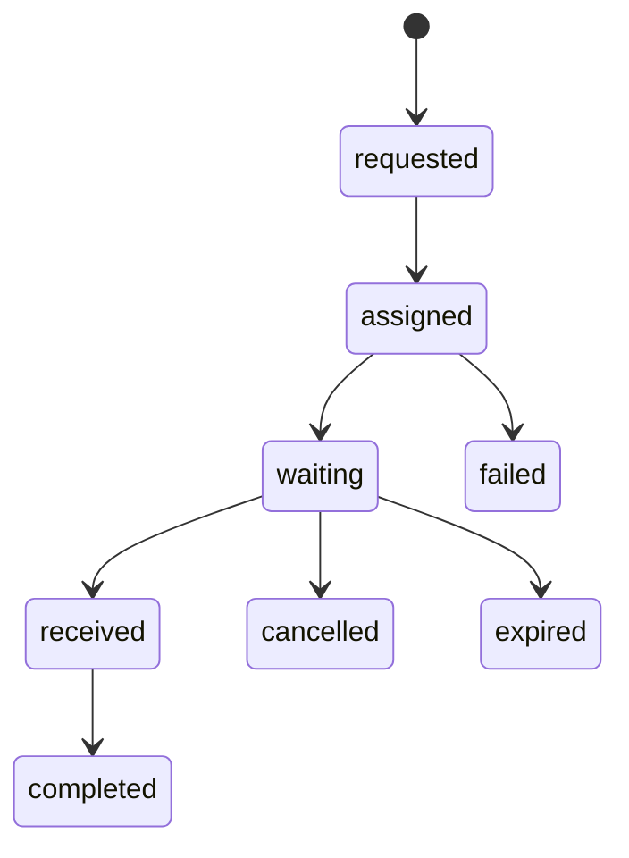
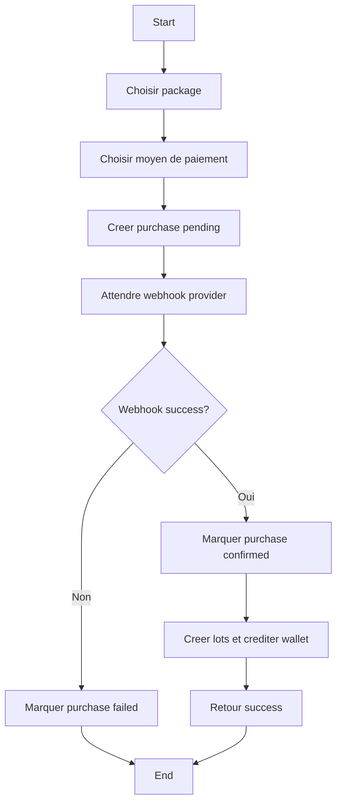

# Wallet Recharge — UML & MERISE (FR)

## 1) Objectif

Ce document décrit le traitement des données pour le flow **Wallet + Recharge** en s'appuyant sur les sources métier et techniques déjà présentes dans le projet.  
La référence métier reste `plan.md` et `economics_model.md`, et la référence technique est l'implémentation livrée dans les fichiers listés en fin de document.

---

## 2) Périmètre fonctionnel

- Gestion du solde utilisateur (base, bonus, promo)
- Achat de crédits par package (initiation, confirmation, créditation)
- Demande de numéro SMS (quote, hold, assignation provider, lifecycle)
- Webhooks paiement (MoMo / Orange) avec contrôle de secret
- Dashboard admin de pilotage (métriques, audit, fraude, config)

---

## 3) MERISE — MCD (Modèle conceptuel de données)

---

## 4) MERISE — MLD (Modèle logique des données)

Entités clés et rôle:

- `credit_package`: catalogue de recharges (prix, bonus, tri, activation)
- `platform_config`: constantes économiques DB-driven (valeurs typées)
- `credit_wallet`: agrégat des soldes utilisateur
- `credit_lot`: granularité de stock (expiration + source)
- `credit_hold`: réservation temporaire pour activation SMS
- `credit_purchase`: transaction d'achat de crédits (états paiement)
- `credit_transaction`: journal comptable des mouvements
- `service` + `service_country_price`: pricing des services et variantes pays
- `provider` + `provider_service_cost`: routage fournisseur et coût grossiste
- `sms_activation`: cycle de vie d'une commande de numéro
- `admin_audit_log`: traçabilité des actions admin
- `fraud_rule` + `fraud_event`: détection et décision anti-fraude

---

## 5) MERISE — MPD (Modèle physique)

Choix physiques appliqués:

- Identifiants texte (`text`) pour compatibilité avec le style existant
- Crédits en `integer`
- Montants financiers en `numeric` / `decimal`
- États métier en `pgEnum` (hold, purchase, activation, approval, payment method)
- Index ciblés sur:
  - statuts (`credit_purchase.status`, `credit_hold.state`, `sms_activation.state`)
  - jointures (`*_id`)
  - lectures admin (`admin_audit_log.created_at`, `fraud_event.is_resolved`)

---

## 6) UML — Cas d'utilisation

---

## 7) UML — Diagramme de séquence (Recharge crédits)

---

## 8) UML — Diagramme de séquence (Activation SMS)

---

## 9) UML — États (Purchase / Hold / Activation)

---

## 10) UML — Activité (moteur de recharge)

---

## 11) Flux de données détaillé (Wallet)

1. Le client récupère ses packages (`GET /api/client/credits/packages`) et son solde (`GET /api/client/credits/balance`).
2. À l'initiation d'un paiement, une ligne `credit_purchase` est créée avec un `idempotencyKey`.
3. Le webhook sécurisé confirme le paiement et déclenche la créditation.
4. Le moteur ledger crée les `credit_lot` (base, bonus), met à jour `credit_wallet`, et écrit `credit_transaction`.
5. Le dashboard admin agrège ces données (`/api/admin/dashboard/overview`) pour le pilotage.

---

## 12) Analyse pattern UI MySpace réutilisable

Le composant `service-explorer` montre un pattern exploitable pour Wallet:

- barre sticky (search + toggles)
- vues list/grid interchangeables
- cartes interactives avec état hover/active
- hiérarchie visuelle dark + accents colorés

Ce pattern peut être repris pour:

- liste des packages de recharge
- table/historique des transactions
- selector de providers dans un drawer shell

Référence: `src/app/[locale]/(main)/my-space/_components/service-explorer.tsx`

---

## 13) Références des fichiers implémentés

### Architecture / documentation
- `docs/economics-architecture.mdx`
- `wallet_recharge_merise_uml.md`

### Schéma / migration / seed
- `src/database/schema.ts`
- `migrations/0001_daily_silver_fox.sql`
- `scripts/seed-economics.ts`
- `package.json` (`seed:economics`)

### Services métiers
- `src/lib/economics/config-service.ts`
- `src/lib/economics/report-economics-model.ts`
- `src/lib/economics/credit-ledger-service.ts`
- `src/lib/economics/payment-purchase-service.ts`
- `src/lib/economics/provider-routing-service.ts`
- `src/lib/economics/activation-service.ts`
- `src/lib/economics/jobs.ts`
- `src/lib/economics/webhook-security.ts`
- `src/lib/economics/api-auth.ts`

### API client
- `src/app/api/client/credits/packages/route.ts`
- `src/app/api/client/credits/purchase/route.ts`
- `src/app/api/client/credits/balance/route.ts`
- `src/app/api/client/activations/request/route.ts`
- `src/app/api/client/activations/[id]/route.ts`
- `src/app/api/client/activations/[id]/cancel/route.ts`
- `src/app/api/client/activations/history/route.ts`

### API admin / webhooks
- `src/app/api/admin/config/settings/route.ts`
- `src/app/api/admin/credits/packages/route.ts`
- `src/app/api/admin/dashboard/overview/route.ts`
- `src/app/api/admin/fraud/events/route.ts`
- `src/app/api/admin/audit/logs/route.ts`
- `src/app/api/webhooks/momo/route.ts`
- `src/app/api/webhooks/orange/route.ts`

### Pages UI
- `src/app/[locale]/(main)/economics/page.tsx`
- `src/app/[locale]/(main)/admin/layout.tsx`
- `src/app/[locale]/(main)/admin/dashboard/page.tsx`
- `src/app/[locale]/(main)/admin/config/page.tsx`
- `src/app/[locale]/(main)/admin/credits/page.tsx`
- `src/app/[locale]/(main)/admin/fraud/page.tsx`
- `src/app/[locale]/(main)/admin/audit/page.tsx`

### Tests
- `src/lib/economics/report-economics-model.test.ts`
- `src/lib/economics/webhook-security.test.ts`

---

## 14) Prochaine étape recommandée

Pour coller exactement à ta demande Wallet/MySpace:

1. Créer un `wallet-page-shell` qui reprend les patterns visuels de `service-explorer`.
2. Introduire un `recharge-drawer` global (trigger header + page wallet + CTA footer).
3. Brancher le drawer sur les endpoints déjà en place (`purchase`, `balance`, `packages`) avec un mapper provider extensible.
